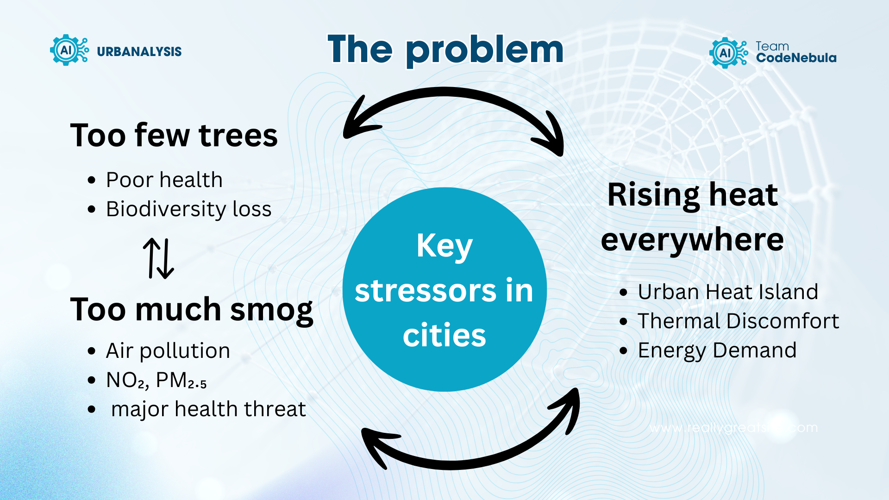
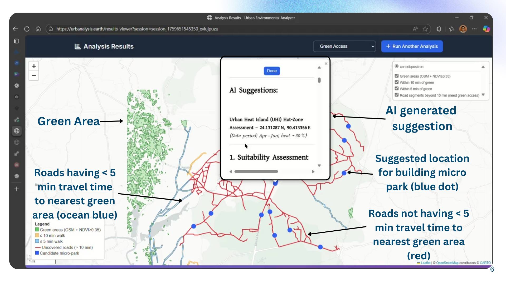
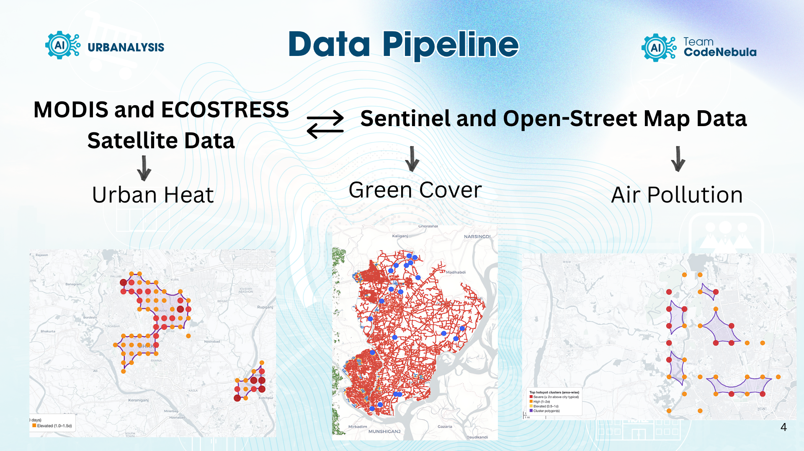

# 🌍 [Urbanalysis](https://urbanalysis.earth): Urban Heat, Air Quality and Green Access Analyzer


[urbanalysis.earth](https://urbanalysis.earth)


### AI-Driven Urban Sustainability Planner

**Integrating NASA and ESA Satellite Intelligence for Greener, Cooler, Cleaner Cities.**

(Its an preview version of the web app to showcase its core functionalities.)

---

## 🛰️ Overview

This project was developed by **Team Codenebula** as part of the [NASA Space Apps Challenge 2025](https://www.spaceappschallenge.org/2025/challenges/data-pathways-to-healthy-cities-and-human-settlements/).

It is an intelligent **Smart Urban Planning Web Application** that helps planners and policymakers analyze and mitigate three major urban environmental challenges:

* 🌳 **Green Space Deficiency Analysis**
* 🌡️ **Urban Heat Island (UHI) Detection & Analysis**
* 🌫️ **Air Quality Hotspot Identification**

Through the fusion of **Earth Observation (EO)** data from NASA and ESA satellites with **AI-powered analytical frameworks**, the platform enables data-driven, evidence-based, and scalable urban decision-making.

<p align="center">
  
</p>

---

## 🧭 Table of Contents

* [Overview](#️-overview)
* [Core Functionalities](#-core-functionalities)
* [How It Works](#️-how-it-works)
  * [Green Access Analysis](#-green-access-analysis)
  * [Urban Heat Island Analysis](#-urban-heat-island-analysis)
  * [Air Quality Analysis](#-air-quality-analysis)
* [NASA & ESA Data Sources](#️-nasa--esa-data-sources)
* [Local Deployment Guide](#-local-deployment-guide)
* [Acknowledgments](#-acknowledgments)
* [License](#-license)

---

## 💡 Core Functionalities

Our system transforms complex satellite datasets into actionable, location-specific insights using a combination of **geospatial analytics** and **AI-powered natural language generation**:

1. **Urban Heat Island (UHI) Analysis** – Detect and map high-temperature clusters using MODIS and ECOSTRESS LST data.
2. **Air Quality Analysis** – Identify NO₂ and PM₂.₅ concentration hotspots using Sentinel-5P and GEOS-CF data.
3. **Green Access Analysis** – Quantify vegetation distribution and detect “green space gaps” using Sentinel-2 NDVI and OpenStreetMap park data.
4. **AI Decision Support** – The system uses a Large Language Model (LLM) to translate technical analyses into human-readable planning advice.
5. **Interactive Visualization** – Web-based, map-centric interface for planners to explore layers, hotspots, and AI recommendations interactively.

<p align="center">
  
</p>

---

## ⚙️ How It Works

### 🟢 Green Access Analysis

**Objective:** Detect vegetation-deficient neighborhoods and recommend new micro-parks.
**Pipeline:**

* Retrieve **Sentinel-2 surface reflectance** (Bands 8 & 4).
* Compute **NDVI = (NIR – Red) / (NIR + Red)**.
* Classify NDVI into low (< 0.2), moderate (0.2–0.5), and high (> 0.5) greenness zones.
* Overlay with **OpenStreetMap (OSM)** data for roads, parks, and accessibility.
* Identify underserved zones beyond a **10-minute walking radius** from existing parks using **OSMnx isochrones**.
* Feed contextual data (population, soil, terrain) into the AI engine for micro-park recommendations.

**Output:**
Interactive NDVI maps, green gap overlays, and AI-generated “Suitability & Recommendation” briefs .

---

### 🔴 Urban Heat Island Analysis

**Objective:** Detect heat stress zones for cooling interventions.
**Pipeline:**

* Acquire **MODIS day/night** and **ECOSTRESS** Land Surface Temperature (LST) data.
* Compute **z-score anomalies** relative to city means.
* Apply **DBSCAN clustering** to identify contiguous heat clusters (> 2σ).
* Integrate land cover, NDVI, and population exposure data.

**Output:**
Severity-coded UHI maps (Elevated / High / Severe) with tables showing population exposure and recommended cooling measures (e.g., green roofs, reflective surfaces, tree corridors) .

---

### 🟣 Air Quality Analysis

**Objective:** Locate air pollution hotspots and vulnerable communities.
**Pipeline:**

* Aggregate **Sentinel-5P NO₂** and **GEOS-CF PM₂.₅** reanalysis data.
* Standardize via z-scores and apply **DBSCAN clustering** to delineate hotspots.
* Enrich with contextual layers (population, schools, hospitals, industrial zones).

**Output:**
Pollution cluster maps, exposure summaries, and AI briefs linking pollution with land use and policy interventions .

<p align="center">
  
</p>

---

## 🛰️ NASA & ESA Data Sources

### NASA Data

| Dataset                                                   | Description                                               | Link                                                                     |
| --------------------------------------------------------- | --------------------------------------------------------- | ------------------------------------------------------------------------ |
| **Landsat Program**                                       | Historical reference and fallback for NDVI composites     | [https://landsat.gsfc.nasa.gov/](https://landsat.gsfc.nasa.gov/)         |
| **SMAP (Soil Moisture Active Passive)**                   | Soil moisture context for vegetation and UHI modeling     | [https://smap.jpl.nasa.gov/](https://smap.jpl.nasa.gov/)                 |
| **MODIS (Moderate Resolution Imaging Spectroradiometer)** | Land surface temperature and aerosol data                 | [https://modis.gsfc.nasa.gov/](https://modis.gsfc.nasa.gov/)             |
| **ECOSTRESS**                                             | High-resolution thermal data for intra-urban heat mapping | [https://ecostress.jpl.nasa.gov/](https://ecostress.jpl.nasa.gov/)       |
| **SEDAC (Socioeconomic Data and Applications Center)**    | Population and exposure context                           | [https://sedac.ciesin.columbia.edu/](https://sedac.ciesin.columbia.edu/) |

### ESA / Partner Data

| Dataset                              | Description                                            | Link                                                                                                                                   |
| ------------------------------------ | ------------------------------------------------------ | -------------------------------------------------------------------------------------------------------------------------------------- |
| **Copernicus Sentinel-2**            | NDVI-based vegetation monitoring                       | [https://sentinels.copernicus.eu/web/sentinel/missions/sentinel-2](https://sentinels.copernicus.eu/web/sentinel/missions/sentinel-2)   |
| **Copernicus Sentinel-5P**           | Air quality (NO₂, O₃, SO₂) monitoring                  | [https://sentinels.copernicus.eu/web/sentinel/missions/sentinel-5p](https://sentinels.copernicus.eu/web/sentinel/missions/sentinel-5p) |
| **JRC Global Surface Water**         | Water body reference and blue-green corridor detection | [https://global-surface-water.appspot.com/](https://global-surface-water.appspot.com/)                                                 |
| **ISRIC SoilGrids**                  | Soil data for suitability assessment                   | [https://www.isric.org/explore/soilgrids](https://www.isric.org/explore/soilgrids)                                                     |
| **OpenStreetMap**                    | Roads, green polygons, land use                        | [https://www.openstreetmap.org/](https://www.openstreetmap.org/)                                                                       |
| **WorldPop / GHSL / Copernicus DEM** | Population and elevation context                       | [https://www.worldpop.org/](https://www.worldpop.org/)                                                                                 |

<p align="center">
  
</p>
---

## 💻 Local Deployment Guide

### 🧩 Requirements

* **RAM:** ≥ 4 GB
* **Processor:** Any modern multi-core CPU
* **Python Version:** 3.11.9
* **APIs:**

  * Google Earth Engine API
  * Groq API

---

### Architecture
The system runs with two backend servers. One liteweight server for the UI interface controll and another for running the analysis. The UI server communicates with the analysis server.

Client <---> UI Server <---> Analysis server

### ⚙️ Setup Instructions

1. **Clone the repository**

   ```bash
   git clone https://github.com/IamDipankar/urbanalysis.git
   cd urbanalysis
   ```

2. **Create a Conda virtual environment**

   ```bash
   conda create -n urbanenv python=3.11.9
   ```

3. **Activate the environment**

   ```bash
   conda activate urbanenv
   ```

4. **Install dependencies**

   ```bash
   pip install -r requirements.txt
   ```

5. **Create a `.env` file**
   
   Create a `.env` file in the root directory with the following configuration:

   ```env
   EE_SERVICE_ACCOUNT=<Your earth engine service account>
   EE_KEY_B64=<Your earth engine key json file base64 encrypted>
   GROQ_API_KEY=<Your groq api key>
   REMOTE_SERVER_URL=<Remote server / Analysis server URL>
   MAIN_SERVER_URL=<Main server / UI server URL>
   ```

6. **Run the application**

   ```bash
   uvicorn main:app --host 0.0.0.0 --workers 1 --port <Give a port name>
   ```
   Open a different terminal instance and run:

   ```bash
   uvicorn remotemain:app --host 0.0.0.0 --workers 1 --port <Different port name>
   ```

   Here an url will be generated for each server depending on port and host. This urls should match with the `.env` file.


6. **Load the web app**
   Click on the link shown in your console (eg. `http://127.0.0.1:8000` or `localhost:8000`) to open this site on your browser.

---
## 👥 The Team

**Team Codenebula**

| Role | Name | Responsibilities |
|------|------|------------------|
| **Team Lead** | Abrar Faiaz | Planning, Data pipeline generation, processing, prompt engineering |
| **Web Developer** | Dipankar Mitra | Web application development, AI integration |
| **Urban Analyzer** | Apurbo Kumar | Policy searching, urban planning strategies |

---

## 🤝 Acknowledgments

We gratefully acknowledge:

* **NASA** and **ESA** for providing open-access satellite datasets (MODIS, ECOSTRESS, Sentinel-2, Sentinel-5P).
* **Google Earth Engine** for geospatial data access and processing.
* **OpenStreetMap** for open geographic data.
* **FastAPI** for backend development.
* **OSMnx** for network and accessibility analysis.
* The **AI and data science community** for continuous innovation in open geospatial intelligence.

---
